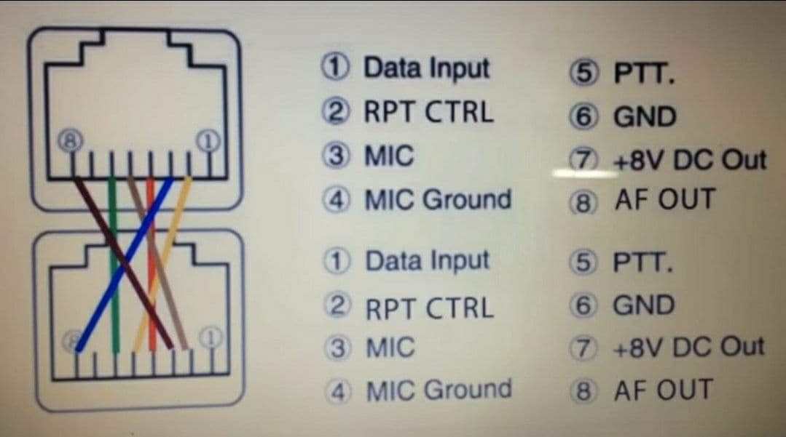
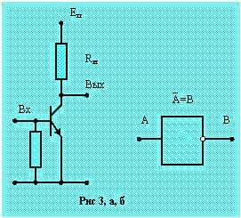
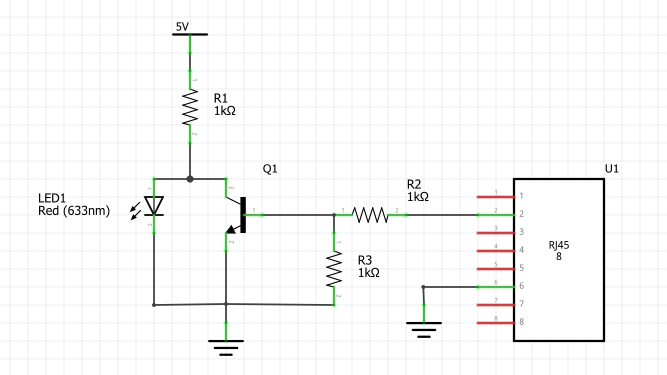
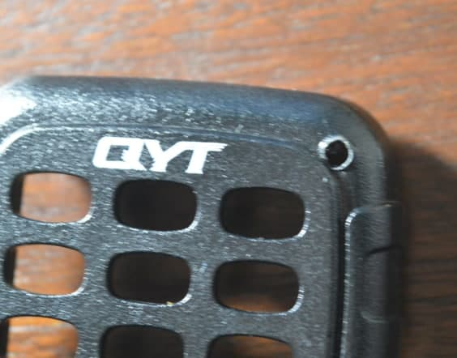
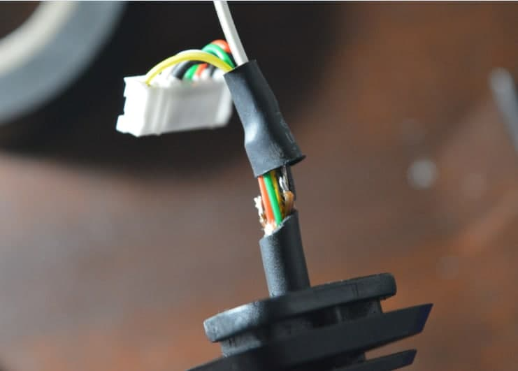
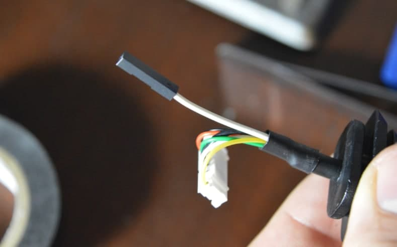
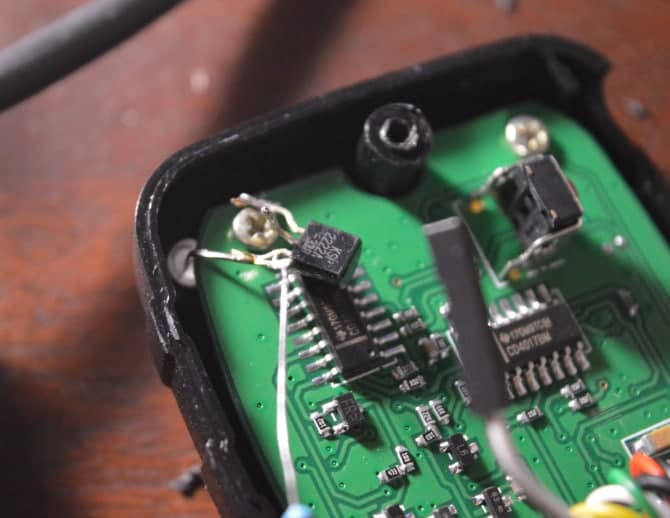
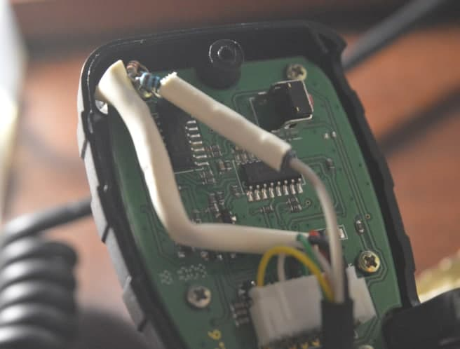
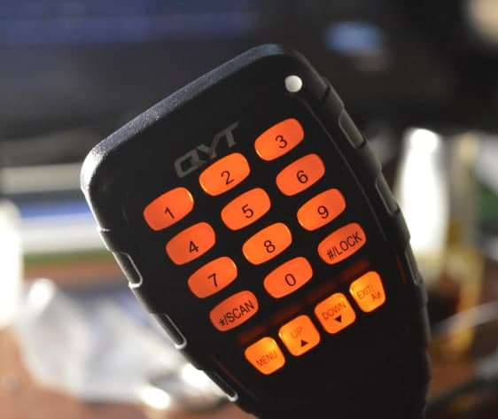

# Activity indicator ([RU](README.md))

It's just a LED indicates squelch state. Just use signal from pin 2 and invert it:

## Components

- NPN transistor (i.e. 2222)
- 3 resistors 1k
- LED

## Step 1

Unmount PTT front panel and drill a hole for LED

## Step 2

Look for a hidden cut wire from the second pin of RJ45

## Step 3

Make it longer

## Step 4

Mount components

## Step 5

Enable REP-M mode and test it:

No activity

Someone on the air

