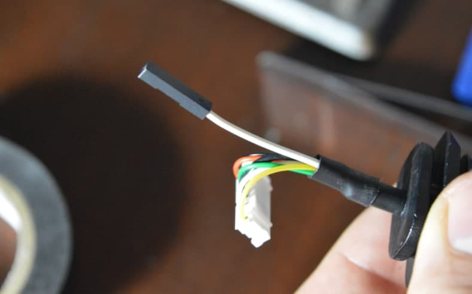
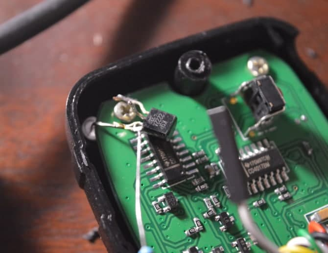
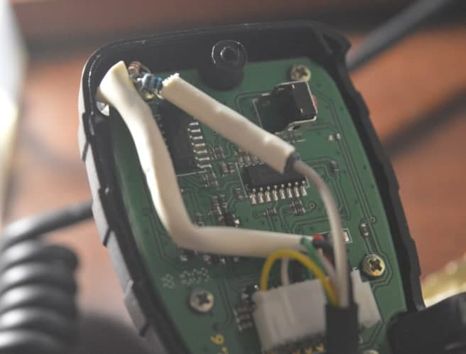

# Индикатор активности ([EN](README.md))

Это просто светодиод, который светится при открытии шумодава. Нужно лишь инвертировать сигнал, поступающий со второго пина:

## Компоненты

- NPN транзистор (i.e. 2222)
- 3 резистора 1К
- светодиод

## Шаг 1

Разберите тангенту и просверлите отверстие для светодиода

## Шаг 2

Под термоусадкой найдите скрытый обрезанный провод от пина 2

## Шаг 3

Удлините провод

## Шаг 4

Смонтируйте компоненты согласно схеме

## Step 5

В меню станции включите режим REP-M и проверьте работоспособность индикатора:

Шумодав закрыт

Активность в эфире, шумодав открыт

