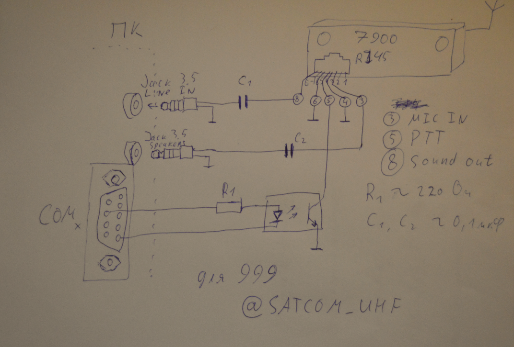
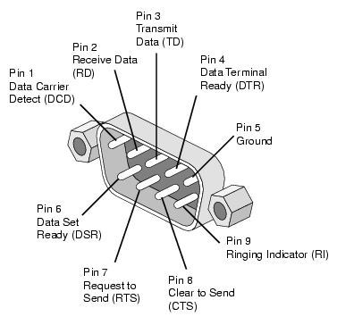
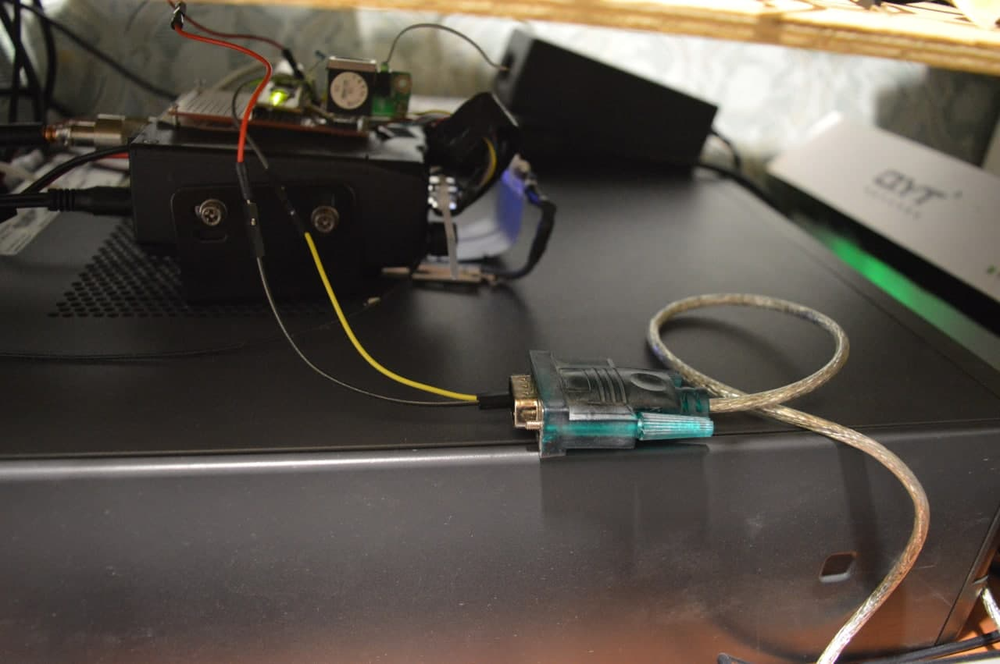

# [Пакетное радио](https://etnowiki.ru/wiki/Packet_radio) на коленке

В данной статье мы рассмотрим как организовать пакетную связь доступными средствами. Для приема и передачи сигнала будет использован трансивер Qyt KT-7900D. Преобразовывать текст в звуковой сигнал и обратно будет компьютер под управлением Windows.

## Программное обеспечение
- Модем от UZ7HO [SoundModem](http://uz7.ho.ua/modem_beta/soundmodem113.zip) 
- Терминал от UZ7HO [EasyTerm](http://uz7.ho.ua/apps/easyterm49.zip)

## Коммутация между трансивером и ПК
Общая схема приблизительно такая:

Звуковой выход трансивера (у Qyt он выведен на 8м пине RJ45) мы подключаем к линейному входу звуковой карты ПК. Звуковой выход компьютера подключаем к микрофонному входу трансивера (у Qyt он выведен на 3й пин RJ45). Для развязки по постоянному применены конденсаторы. Для полной гальванической развязки можно применить трансформаторы.

Простейший способ позволить SoundModem переходить из режима приема в режим передачи - это указать COM-порт, к которому подключен ваш трансивер. SoundModem использует 7й пин (RTS) для активации PTT. В качестве коммутирующего элемента можно использовать оптопару с резистором (как на схеме), или сделать ключ на каком-нибудь MOSFETе. 

 

 Если на вашем ПК отсутствует аппаратный COM-порт, вы можете использовать USB-COM переходник.

