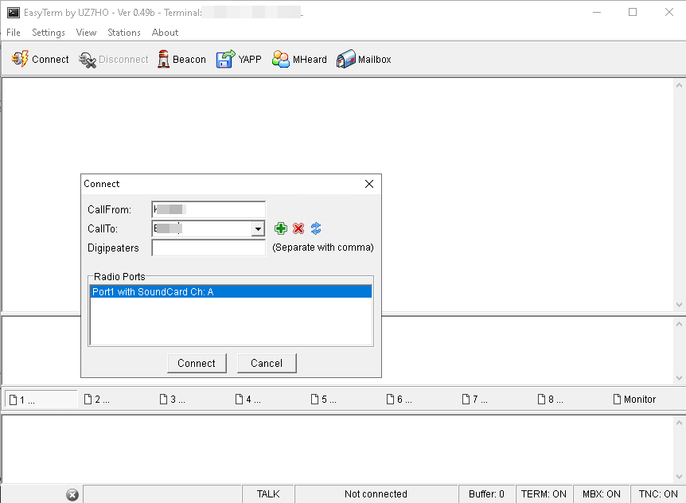

# [Пакетное радио](https://etnowiki.ru/wiki/Packet_radio) на коленке

<video src="https://user-images.githubusercontent.com/90838159/282679990-01b05537-150c-46a9-a750-b3de58aedcb6.mp4" data-canonical-src="https://user-images.githubusercontent.com/90838159/282679990-01b05537-150c-46a9-a750-b3de58aedcb6.mp4" controls="controls" muted="muted" class="d-block rounded-bottom-2 border-top width-fit" style="max-height:640px; min-height: 200px"></video>

В данной статье мы рассмотрим как организовать пакетную связь доступными средствами. Для приема и передачи сигнала будет использован трансивер Qyt KT-7900D. Преобразовывать текст в звуковой сигнал и обратно будет компьютер под управлением Windows.

## Программное обеспечение
- Модем от UZ7HO [SoundModem](http://uz7.ho.ua/modem_beta/soundmodem113.zip) 
- Терминал от UZ7HO [EasyTerm](http://uz7.ho.ua/apps/easyterm49.zip)

## Коммутация между трансивером и ПК
Общая схема приблизительно такая:

Звуковой выход трансивера (у Qyt он выведен на 8м пине RJ45) мы подключаем к линейному входу звуковой карты ПК. Звуковой выход компьютера подключаем к микрофонному входу трансивера (у Qyt он выведен на 3й пин RJ45). Для развязки по постоянному применены конденсаторы. Для полной гальванической развязки можно применить трансформаторы.

Простейший способ позволить SoundModem переходить из режима приема в режим передачи - это указать COM-порт, к которому подключен ваш трансивер. SoundModem использует 7й пин (RTS) для активации PTT. В качестве коммутирующего элемента можно использовать оптопару с резистором (как на схеме), или сделать ключ на каком-нибудь MOSFETе. 

 

 Если на вашем ПК отсутствует аппаратный COM-порт, вы можете использовать USB-COM переходник.

## Настройка приемной части

1. Подключите звуковой выход станции к линейному входу ПК. У Qyt есть особенность: чтобы звуковой сигнал появился на пине 8 в меню станции необходимо выбрать пункт REP-M и установить там значение Carrier.
2. Установите линейный вход устройством записи по умолчанию

3. Настройте уровень сигнала таким образом, чтобы не было "перегруза"

4. Распакуйте и запустите [SoundModem](http://uz7.ho.ua/modem_beta/soundmodem113.zip) 
5. Откройте меню настроек Settings->Devices и убедитесь, что для ввода и вывода звука выбраны верные входы и выходы. Также выберите COM порт, к которому подключен ваш трансивер

6. Убедитесь, что траффик, который вы принимаете от BBS, успешно демодулируется

## Настройка передающей части

1. Убедитесь, что звуковой выход ПК подключен к микрофонному входу станции
2. Убедитесь, что SoundModem запущен. В настройках Settings->Modems  рекомендуется установить значение параметра TXDelay таким образом, чтобы компенсировать задержку радиостанции на переход в режим передачи. У меня это значение равно 400.

3. Установите громкость воспроизведения близкой к минимальной
   
   

4. Распакуйте и запустите [EasyTerm](http://uz7.ho.ua/apps/easyterm49.zip) В окне терминала нажмите "Connect".
5. В появившемся диалоге укажите ваш позывной и позывной узла, с которым хотите соединиться.Еще раз нажмите "Connect".
   

6. Вуаля! Дальше вы можете общаться текстовыми командами с узлом, к которому подключились.
   

## PS

Выражаю огромную благодарность [UZ7HO](http://uz7.ho.ua/packetradio.htm) за труды по созданию ПО для Windows. На его [официальной страничке](http://uz7.ho.ua/packetradio.htm) так же можно скачать ПО для игры в [шахматы](http://uz7.ho.ua/apps/chess10.zip) и [шашки](http://uz7.ho.ua/apps/checkers6.zip).
