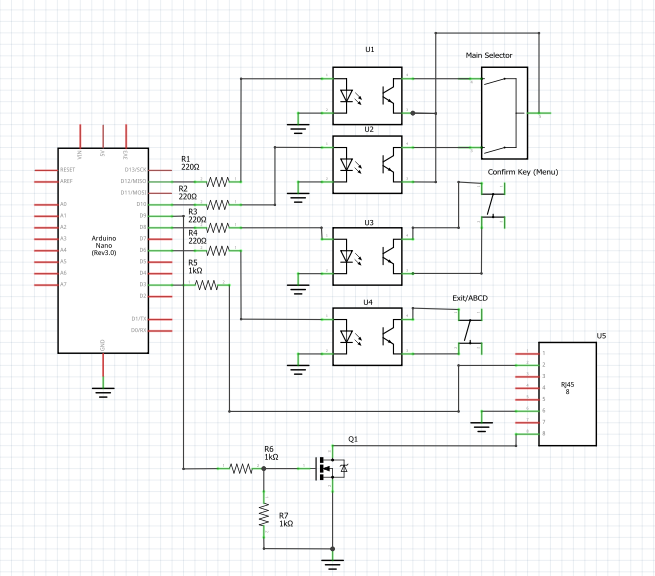
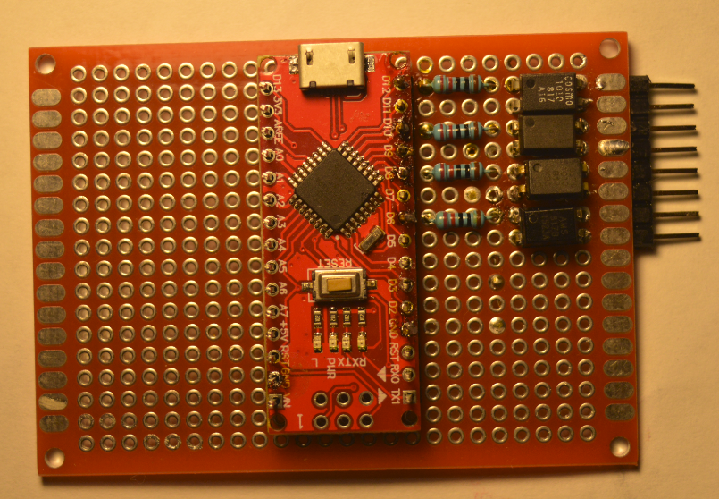
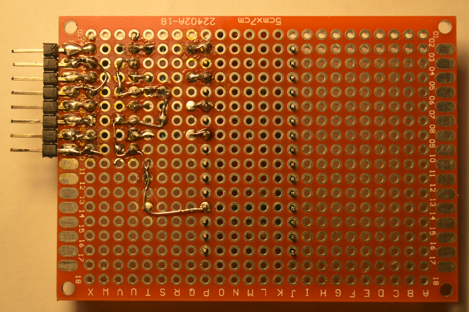
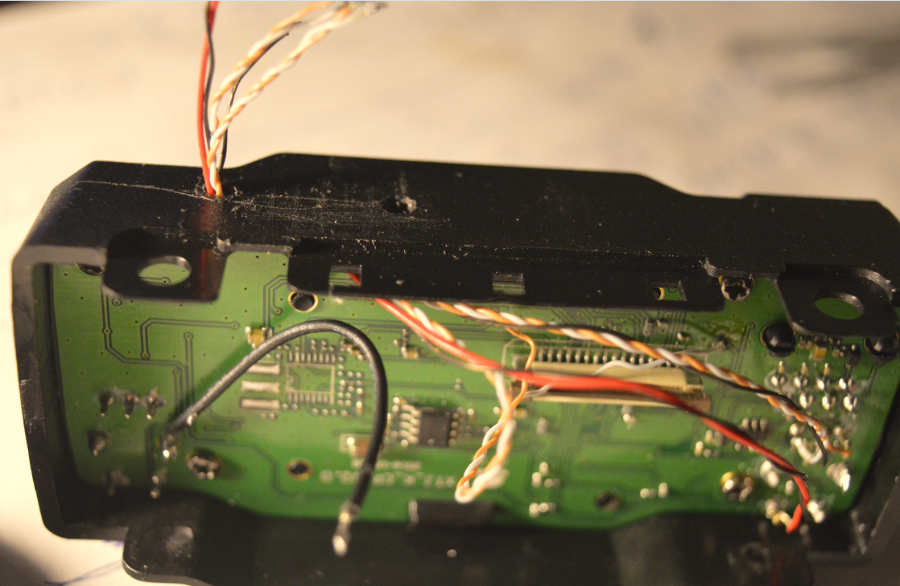

# Remote control adapter for QYT-KT7900D ([RU](README_RU.md))

The remote control adapter allows pressing buttons on the front panel programmatically via serial port. It can be useful for deep integration with any kind of software (i.e. Telegram Bot).  The following commands are supported:

- ```+``` is equal to "Up"
- ```-``` is equal to "Down"
- ```e``` is equal to "Exit/ABCD"
- ```m``` is equal to "Menu"

This command set is enough to change the most of settings and select any channels.
### Components required
- [Arduino Nano](https://docs.arduino.cc/hardware/nano)
- [PC817 x 4](https://www.farnell.com/datasheets/73758.pdf)
- 4 resistors (220 Ohms)
- wires
- connector (7 or 8 pins)
- bread board
### Tools required:
- Soldering iron =)
- [Fritzing](https://github.com/fritzing/fritzing-app/releases) to view/edit the scheme (RemoteControl.fzz)
- [Arduino IDE](https://www.arduino.cc/en/software) to compile/upload sketch (RemoteControl.ino) to your Arduino board



### Step 1. Mount and solder all components on the board



### Step 2. Open  RemoteControl.ino using Arduino IDE and upload it to Arduino Nano
### Step 3. Remove the front panel and connect the wires to the following points



### Step 4. Glue the connector with superglue


### Step 5. Connect the module


