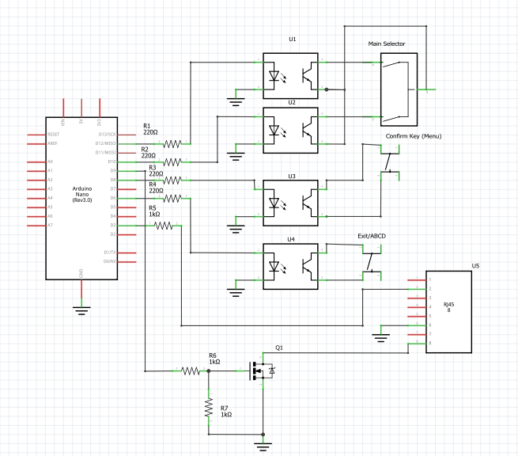
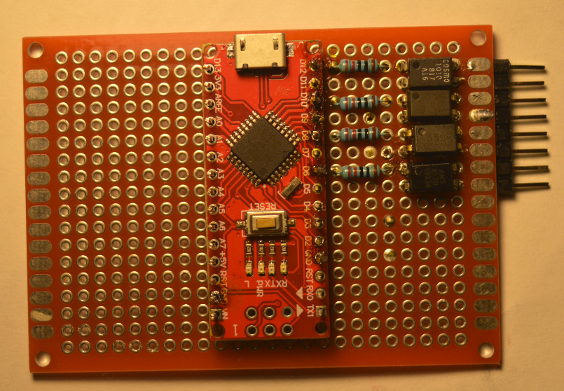
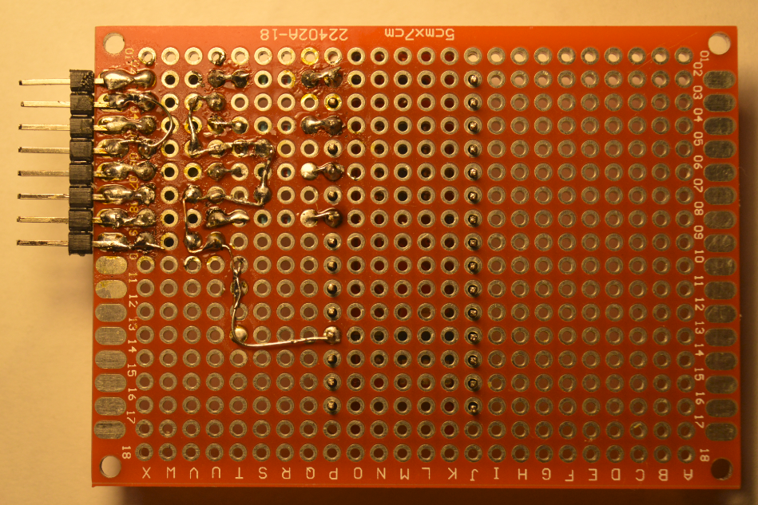
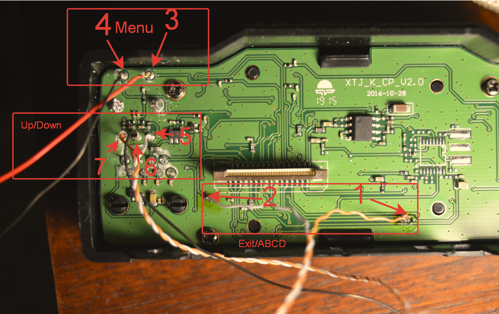
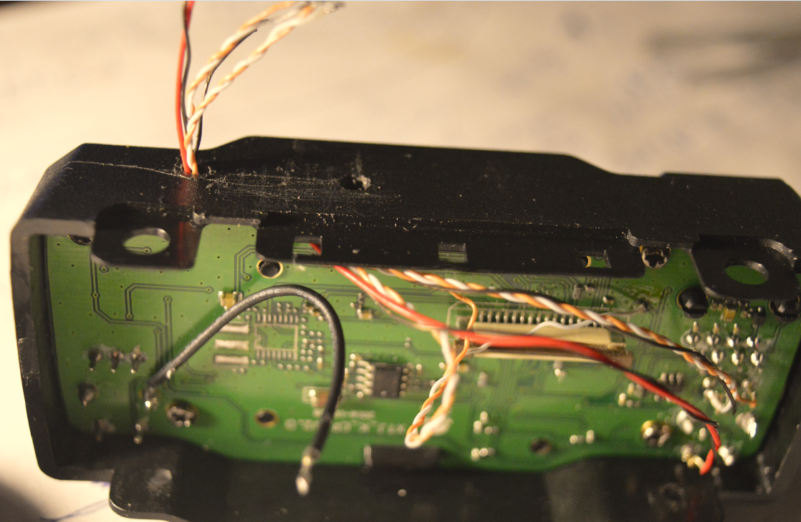
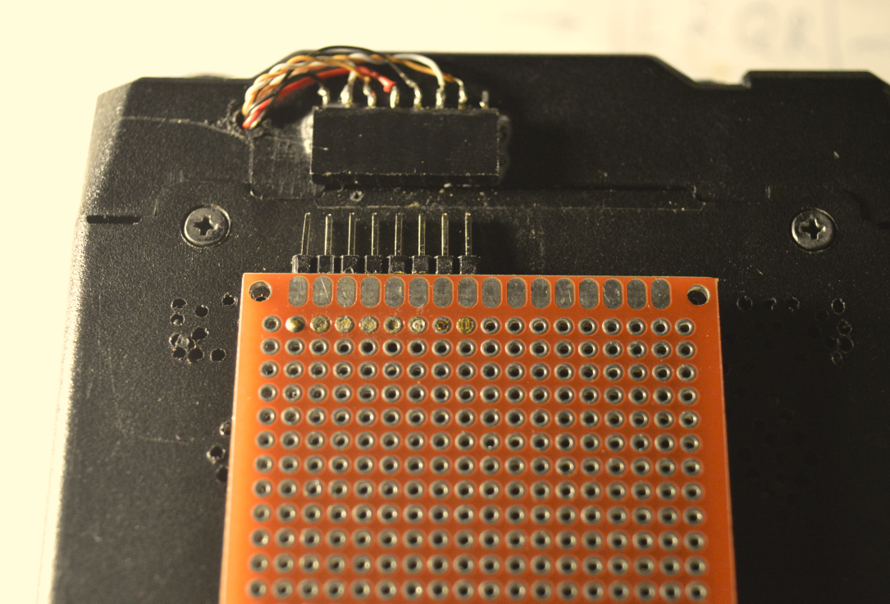
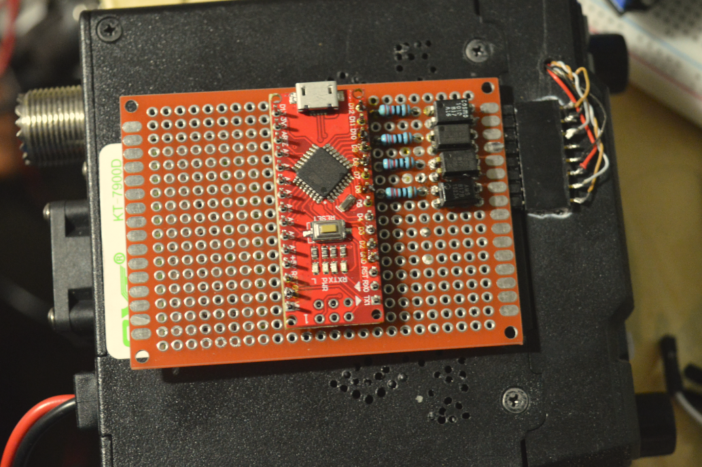

# Адаптер для удаленного управления QYT-KT7900D ([EN](README.md))

Адаптер позволяет программно нажимать на кнопки передней панели станции через последовательный порт. Это может быть полезно для тесной интеграции с каким-либо сторонним ПО (например Telegram Bot).  Поддерживаемые команды:

- ```+``` "Вверх"
- ```-``` "Вниз"
- ```e``` "Exit/ABCD"
- ```m``` "Menu"

Данного набора команд достаточно чтобы программно изменить большинство настроек станции или выбрать нужный канал (каналы)

### Компоненты

- [Arduino Nano](https://docs.arduino.cc/hardware/nano)
- [PC817 x 4](https://www.farnell.com/datasheets/73758.pdf)
- 4 резистора (220 Ом)
- тонкие провода
- разьем 7 или 8 пинов
- макетная плата

### Инструменты

- Паяльник =)
- [Fritzing](https://github.com/fritzing/fritzing-app/releases) чтобы посмотреть файл схемы (RemoteControl.fzz)
- [Arduino IDE](https://www.arduino.cc/en/software) чтобы скомпилировать и загрузить скетч (RemoteControl.ino) в Arduino

## Схема


### Шаг 1. Смонтируйте и припаяйте все компоненты на плату согласно схеме



### Шаг 2. Откройте прошивку  RemoteControl.ino с помощью Arduino IDE и загрузите ее в Arduino Nano
### Шаг 3. Снимите переднюю панель и подключите провода к указанным точкам



### Шаг 4. Приклейте разьем суперклеем


### Шаг 5. Подключите адаптер


